# Kubernetes Architecture.

## Master Node

* Master Node is responsible for managing, planning, scheduling and monitoring the nodes.

* Master Node contains multiple components which handles all these operations. These components are called as **Control Plane Components**.

### Control Plane Components: 

1. **etcd**

Containers information are stored in a key-value distributed database which is called as etcd. ETCD is a distributed reliable key-value store that is Simple, Secure and Fast. 
It stores the kubernetes cluster information such as:

  * Nodes
  * Pods
  * Configs
  * Secrets
  * Accounts
  * Roles
  * Bindings
  * Others
  
2. **kube-scheduler**

Kube-scheduler is responsible for placing a right container on a node based on the container resource requirements and constraints.

3. **Controllers-Manager**

Controllers are responsible in Kubernetes for certain areas and sections. There are multiple controllers who does this, such as:

  * Node Controller: The Node Controller takes cares of Nodes. They are responsible for provisioning new Nodes on the cluster, handling of Nodes if not healthy or gets destroyed.
  * Replication Controller: Replication Controller are responsible for checking the desired number of replications running.

4. **kube-apiserver**

The kube-apiserver is responsible for handling all of these components to work all together. It orchestrates all these components in Kubernetes Cluster. 
The kube-apiserver is the external interface for a customer or a user for performing operations and managing the kubernetes cluster.

5. **kubelet**

A kubelet is an agent which runs on each node, it listens the instructions from the kube-apiserver and deletes or creates the nodes as instructed from the kube-apiserver.
Kube-apiserver always fetches information of all the nodes in the cluster for checking the status.

6. **kube-proxy service**

The kube-proxy service is responsible for helping worker nodes to communicate each other.                                                                          
                                                                                               


## Worker Node

Worker nodes hosts applications as containers.

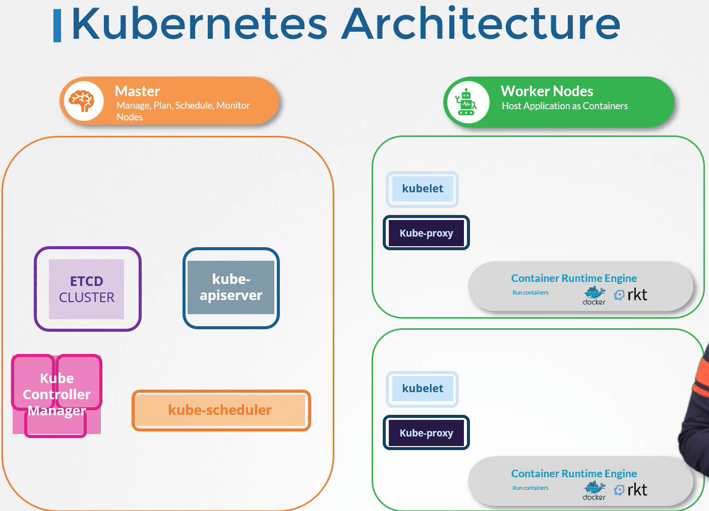

# 1. ETCD 
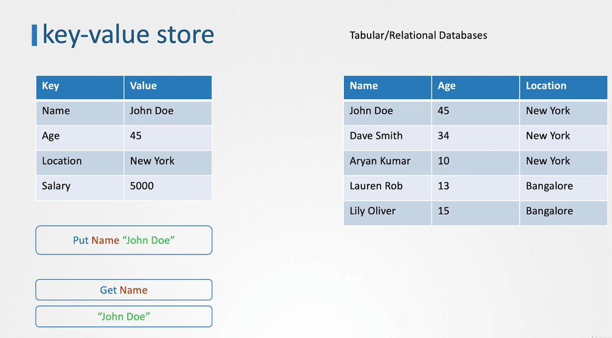

* ETCD runs on port 2379 and can be run using `./etcd` command.
* The default etcd client is `./etcdctl` and can be used to store and retrieve the key value data.
* To store the key value data use `./etcdctl set key1 value1` command. Whereas to retrieve the data use `./etcdctl get key1 ` and for more information use `./etcdctl` command only. 

## ETCD in Kubernetes
* ETCD cluster stores cluster information such as 
  * Nodes
  * Pods
  * Configs
  * Secrets
  * Accounts
  * Roles
  * Bindings
  * Others
* To get all the keys which are stored in Kubernetes etcd use `kubectl exec etcd-master -n kube-system etcdl get / --prefix -keys-only` command.
* Kubernetes stores the data in a specific directory structure. The root directory is the registry directory and under that all directories are present such as minions, pods, replicasets,
  deployments, roles and secrets.
* In a high availability environment, we will have multiple masters node in the cluster on top of that masters node there will be etcd pods. The connection between these etcd pods are configured in the **etcd.service** configuration. In the initial cluster flag, in the **etcd.service** configuration, there we have to specify the etcd pods details.   

# 2. Kube-API Server

* When we execute any `kubectl` command such as `kubectl get nodes` this request goes to kube-api server, kube-api server then authenticates the request and validates it. The kube-api server then request the get nodes data to the etcd cluster and response back with the get nodes data. 

```mermaid
Bob->Alice : hello
```

* Kube-api server performs the below tasks
    1. Authenticate User
    2. Validate Request
    3. Retrieve Data from ETCD cluster
    4. Update Data to ETCD cluster
    5. Scheduler
    6. Kubelet

* Kube-api server is the only component that interacts directly with the etcd datastore.
* If we want to install the kube-api server from the scratch and configure it in detail then we have to install the Kubernetes in a hard-way. For example, we can also configure certificates(SSL/TLS) in the kube-api server to perform secure connections between other components. We can also specify the ETCD server connection in the kube-api serverv config file such as the ETCD pod ip and its port. The default port for the ETCD server in kubernetes is 2379
* To get the kube-api server details, it is totally depends on how we have setup the kubernetes cluster. To setup the kubernetes cluster, there are two ways, using the kubeadm tool or without using the kubeadm which is the hard-way
* To get the details of the kube-api server which is setup using the kubeadm tool, we can get the kube-api server pod by listing all pods using `kubectl get pods -n kube-system ` command.
We can see the definition yaml file for the kube-api server in the /etc/kubernetes/manifests/kube-apiserver.yml location.
* Whereas, if the kubernetes cluster is setup without the kubeadm tool, that is the hard-way, we can see the kube-api server definition yaml file in /etc/systemd/system/kube-apiserver.service. To also see the kube-apiserver process on the master node use `ps aux | grep kube-apiserver` command
     
    
    
# 3. Kube Controller Manager

A controller is a process that continously monitors the state of various components within the system and works towards bringing the whole system to the desired functioning state. 

## i. Node controller

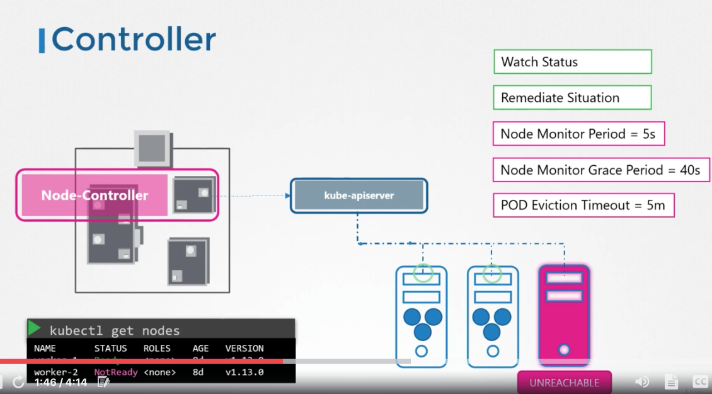

* It is responsible for monitoring the status of the nodes and taking necessary actions to keep the application running it does this using the kube-api server.
* The node controller checks the status of the nodes every 5 seconds that way it monitors the status of the nodes. If node controllers stops receiving heart beats, it declares          that node as unreachable. Before officially declaring the node as unreachable, the node controller waits for more 40 seconds.
* After the node is declared or marked as unreachable, node controller gives 5 minutes to the node to come back. If it does not come, the node controller removes the created pods from that unreachable node and provisions them on the healthy one if the pods are the part of the replica set.  

## ii. Replication Controller

* It is responsible for monitoring the status of the replica sets and ensures that the desired number of pods are available at all times within the replica sets. If a pod dies it creates another one.

* There are multiple controllers present in the controller manager. To download the controller manager, download it from using the kubernetes release page and run it as a service. 

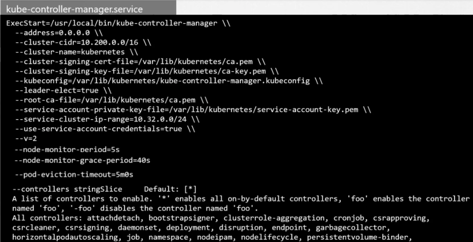

* To configure the controller manager use its service file. All the configuration details such as monitoring period, grace period, timeouts, etc can be configured in this service. By default all the controller are enable, if we want to enable specific controllers we can also do that using the `--controller flag`

* To view the kube-controller-manager server options, it totally depends on how we have setup our kubernetes cluster with or without kubeadm. If kubeadm is used we can see the kube-controller-manager pod using `kubectl get pods -n kube-system` command. To see the kube-controller-manager definition yaml file, see `/etc/kubernetes/manifests/kube-controller-manager.yaml` file

*  To view the kube-controller-manager service file for the cluster which is setup without the kubeadm tool, see `/etc/systemd/system/kube-controller-manager.service` file 

* To see the process of the kube-controller-manager on the master node use `ps aux | grep kube-controller-manager` command.


# 4. Kube Scheduler

* Kube-scheduler only decides which pods goes on which node. It does not actually place the pods on the node, thats the job of kubelet. The kubelet is responsible for creating the pods on the nodes. The scheduler only decides which pods goes on which nodes.

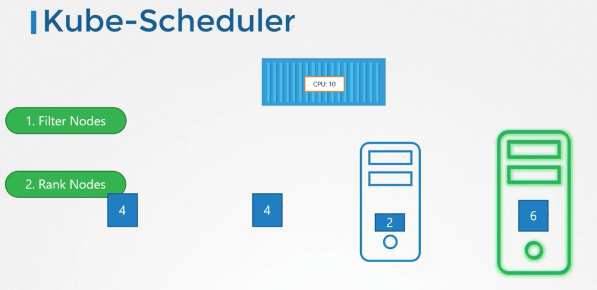

* Kube-scheduler has certain criteria for placing the specific pods on the specific nodes. Criteria such as resource requirements needed, etc. We will be having multiple pods on the nodes which runs specific applications, and scheduler places these pods on that specific nodes which runs that applications. For example, if there is a pod which requires 10 CPU cores and there are 4 nodes which has various CPUs limits. First node has 4 CPU cores, Second has 4 CPU cores, Third has 12 CPU cores and Fourth has 16 CPU cores. So now the scheduler calculates the CPU cores and checks when the pod with 10 CPU cores will be placed on these Four Nodes which will be having more CPU cores left after placing the 10 CPU cores pod. So the best fit will be the Fourth Node which contains 16 CPU cores and when the 10 CPU cores pod will be placed on it then, 6 more CPU cores will be left. So the Fourth Node will get the higher rank than the other nodes. This is how the kube-scheduler places the pods on the nodes.  
 
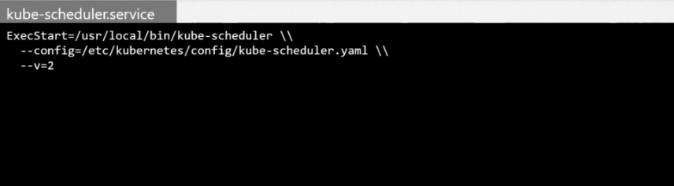
 
* To download the kube-scheduler use the kubernetes official page and run it as a service. We can configure the service file of the kube-scheduler as well. If the cluster is setup using the kubeadm tool, then the kube-scheduler pod is created on the master node and to view the kube-scheduler definition yaml file see `/etc/kubernetes/manifests/kube-scheduler.yaml`

* To see the process on the master node use `ps aux | grep kube-scheduler` command

# 5. Kubelet

* Kubelet registers the nodes in the kubernetes cluster. When it receives the instructions  to load a pods on the nodes it requests the container runtime engine such as Docker to pull the required image and run the pods. The kubelet then monitors the pods and response to the kube-api server on a timely basis.

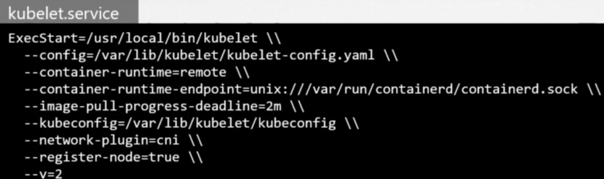

* If we use the kubeadm tool to setup the cluster it does not automatically deploys the kubelet, we have to manually install it on the kubernetes worker nodes. Download it from the kubernetes service, extract it and run it as a service.

* To view the kubelet process on the worker nodes use `ps aux | grep kubelet` command. 

# 6. Kubeproxy

* Kube-proxy is a process on each node in the kubernetes cluster. Its job is to look for new services and every time a new service is created it creates an appropriate rules on each node to forward traffic to those services to the backend pods.

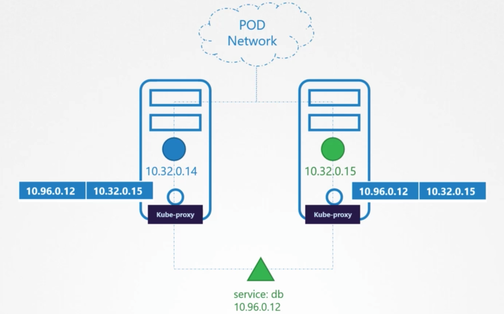

* One way it does this is using the IP tables rules. It creates an IP table rules on each node in the cluster to forward traffic heading to the IP of the service(10.96.0.12) to the IP of the actual pod(10.32.0.15)

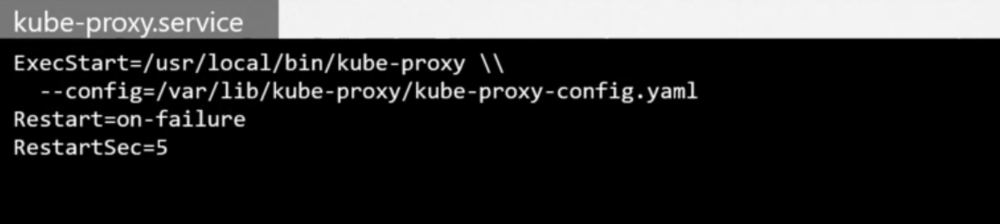

* To download it use the kubernetes service and run it as a service.   

* To view the pod of the kube-proxy use the `kubectl get pods -n kube-system` command.

 
# Namespaces

* There are different namespaces for different purpose. For example, kube-system namespace is the kubernetes official namespace where it deploys all its important components. Next, the second namespace is the default namespace, where we as a user creates our own resources such as pods, deployments, services, replicasets, etc. These namespaces are isolated with each other for not interrupting each other namespaces and keep it secured. The third namespace is kube-public, in this, the resources that should be made available to all users are created. So whenever we setup a kubernetes cluster it creates three namespaces automatically, they are:
       1. kube-system (official kubernetes namespace)
       2. default (for users)
       3. kube-public (for all users to make resources public)

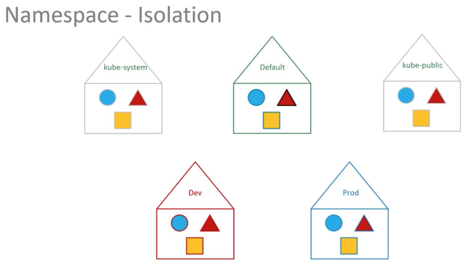
 
* However, we can create our own namespaces as well, for example, if we have multiple environments in an Organisation such as Dev, Stage and Production. We can create that as well.

* We can also ***assign policies and resource limits*** for each namespace and specify who can do what.

* We can also connect any pod to each other. For example, if there is a three tier application in first namespace that contains web-pod, db-service and web-deployment. The web-pod can connect to the db-service by just specifying the db-service name such as like this `mysql.connect("db-service")`. 

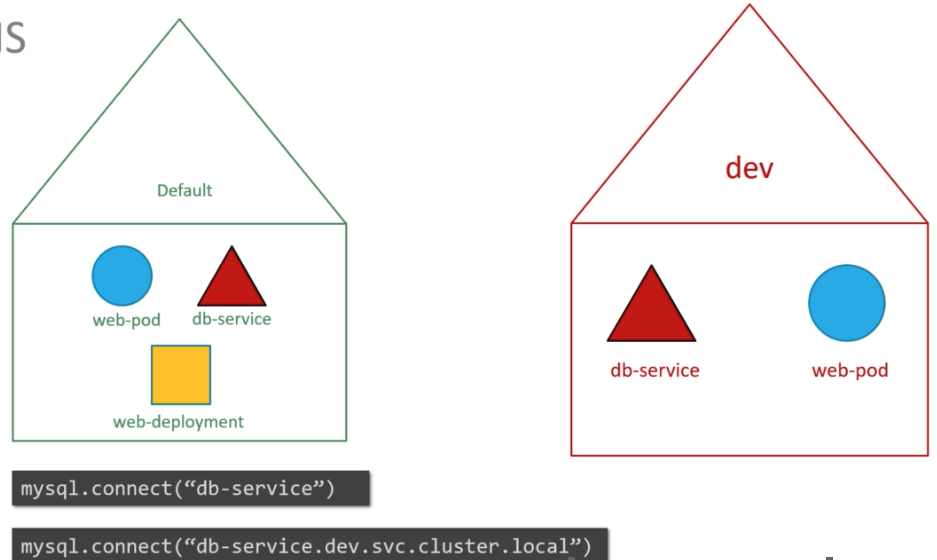

* We can also connect  web-pod from first namespace to another pod(db-service) which is in second namespace by just specifying the namespace name.
For example if the second namespace name is `dev`. Then the command will go like this `mysql.connect("db-service.dev.svc.cluster.local")`

Here, 

    `cluster.local` - Default domain name of the kubernetes cluster
    
    `svc` - subdomain for the service
    
    `dev` - namespace name
    
    `db-service` - service name 

* To list the pods from the default namespace use `kubectl get pods` command. To list the pods from another namespace such as kube-system use `kubectl get pods --namespace=kube-system`

* Next, to create a pod in a default namespace use `kubectl create -f po-definition.yml` command. Whereas, to create a pod in another namespace use `kubectl create -f pod-defintion.yml --namespace=<namespace-name>`

* To create a pod in another namespace using the pod-definition.yml file, specify `namespace: <namespace-name>` under the metadata section.

* To create a namespace using the CLI command use `kubectl create namespace <namespace-name>`. Whereas to create a namespace from the definition.yml file use below script.

```hcl-terraform
apiVersion: v1
kind: Namespace
metadata:
  name: <namespace-name>
```       

* By default, we are in the default namespace. But if we need to swith to another namespace, or to set our custom namespace as a default namespace to us, then we can switch to another namespace by using this `kubectl config set-context $(kubectl config current-context) --namespace=<namespace-name>` command. However, if we need to list the pods of the kubernetes default namespaces after switching to our custom namespaces then we have to specify the `--namespace=default` option  for listing the pods of the kubernetes default namespace. To list the pods from all the namespaces use `kubectl get pods --all-namespaces` command.

* To set the resource limit for a namespace, create a resource quota such as below example:

```hcl-terraform
apiVersion: v1
kind: ResourceQuota
metadata:
  name: <resource-quota-name>
  namespace: <namespace-name>
spec: 
  hard:
    pods: "10"
    requests.cpu: "4"
    requests.memory: 5Gi
    limits.cpu: "10"
    limits.memory: 10Gi    
```

Now, to create this resource quota for specified namespace use `kubectl create -f resource-quota-definition.yml` command.


# Imperative and Declarative Approach

**Imperative Approach Kubernetes Commands for Exam Prepartions:**
```shell script
kubectl run --image=nginx nginx
kubectl create deployment --image=nginx nginx
kubectl expose deployment nginx --port 80
kubectl edit deployment nginx  # Edit command modifies the current state of the kubernetes resources, not the definition yaml files.
kubectl scale deployment nginx --replicas=5 
kubectl set image deployment nginx nginx=nginx:1.18
```

* `--dry-run`: By default as soon as the command is run, the resource will be created. If you simply want to test your command, use the `--dry-run=client` option. This will not create the resource, instead, tell you whether the resource can be created and if your command is right.

* `-o yaml`: This will output the resource definition in YAML format on the screen.

* Generate POD Manifest YAML file (-o yaml). Don't create it(--dry-run) `kubectl run nginx --image=nginx  --dry-run=client -o yaml`

* Create a deployment: `kubectl create deployment --image=nginx nginx`

* Generate Deployment YAML file (-o yaml). Don't create it(--dry-run): `kubectl create deployment --image=nginx nginx --dry-run=client -o yaml`

* `kubectl create deployment` does not have a `--replicas` option. You could first create it and then scale it using the `kubectl scale deployment <deployment-name> --replicas=<count>` command

* Save it to a file - (If you need to modify or add some other details): `kubectl create deployment --image=nginx nginx --dry-run=client -o yaml > nginx-deployment.yaml`. You can then update the YAML file with the replicas or any other field before creating the deployment.

* Create a Service named redis-service of type ClusterIP to expose pod redis on port 6379: `kubectl expose pod redis --port=6379 --name redis-service --dry-run=client -o yaml`. (This will automatically use the pod's labels as selectors) OR `kubectl create service clusterip redis --tcp=6379:6379 --dry-run=client -o yaml` (This will not use the pods labels as selectors, instead it will assume selectors as app=redis. You cannot pass in selectors as an option. So it does not work very well if your pod has a different label set. So generate the file and modify the selectors before creating the service)

* Create a Service named nginx of type NodePort to expose pod nginx's port 80 on port 30080 on the nodes: `kubectl expose pod nginx --port=80 --name nginx-service --type=NodePort --dry-run=client -o yaml`
  (This will automatically use the pod's labels as selectors, but you cannot specify the node port. You have to generate a definition file and then add the node port in manually before creating the service with the pod.) OR `kubectl create service nodeport nginx --tcp=80:80 --node-port=30080 --dry-run=client -o yaml` (This will not use the pods labels as selectors). Both the above commands have their own challenges. While one of it cannot accept a selector the other cannot accept a node port. I would recommend going with the `kubectl expose` command. If you need to specify a node port, generate a definition file using the same command and manually input the nodeport before creating the service

Reference: [https://kubernetes.io/docs/reference/kubectl/conventions/](https://kubernetes.io/docs/reference/kubectl/conventions/)


**Declarative Approach**

* For creating objects everytime, use this command `kubectl apply -f nginx.yml`
* For updating objects everytime, use this command `kubectl apply -f nginx.yml`


# Selectors and Labels

* To list the pods with the all labels use `kubectl get pods --show-labels` command

* To list he pods by label environment = dev use `kubectl get pods -l env=dev --no-headers` 

* To get the pods count in dev environment use `kubectl get pods -l env=dev --no-headers | wc -l`

* To get the pod by filtering multiple labels use `kubectl get pods -l env=prod,bu=finance,tier=frontend` command

* To list the pods by filtering with the selectors and labels use `kubectl get pods --selector app=App1` command.

## Annotations

It records some information such as tool details as, name, versions or contact details, email id that can be used for any integration purpose. 


# Taints and Tolerants

* With the help of taints and tolerants, we can restrict the scheduling of a pod to a particular node. For example, if there are three nodes and three pods. These three pods are not attached to any nodes yet. But when a taint is attached to a node 1 then none of the three pods can be scheduled on the node 1. All of the pods will be scheduled on the node 2 and node 3. However, when we apply tolerant on one of the pod, then that one pod can be scheduled on the node 1 as we have applied tolerant to that pod. Note that, Taints are applied to nodes only and tolerants are applied to a pod.

* To apply taints on a node then use `kubectl taint nodes <node-name> key=value:taint-effect` command. For example, this command can be run as this `kubectl taint nodes node1 app=blue:NoSchedule`


There are three taint effects: 

1. *NoSchedule* - Pods will not be scheduled on the nodes

2. *PreferNoSchedule* - The system will try to avoid scheduling the pods on the nodes, but that is not guaranteed.

3. *NoExecute* : No new pod will be scheduled, and existing pods will be removed if they do not have the tolerant taint. 

* To apply tolerations to the pods use the below block under the `spec` block in the pod definition yaml file.

```yaml
spec:
  tolerations:
  - key: "app"  #taints "key"
    operator: "Equal" #(=)
    value: "blue"  #taints "value"
    effect: "NoSchedule"  #taints effects
```

* Remember, whenever we create new pod, the kubernetes cluster will not schedule the pod on the master node as the taint is already applied to the master node to do not schedule any pods on the master node. To get the information of the taint master node use `kubectl describe node kubemaster | grep Taint` command
 
* To remove the taint from any node, follow below steps:

    * `kubectl describe nodes <node-name> | grep -i Taints`

    * Copy taints value
 
    * `kubectl taint nodes <node-name> <taints-value>-`
 
# Node Selectors

You can constrain a Pod to only be able to run on particular Node(s), or to prefer to run on particular nodes. There are several ways to do this, and the recommended approaches all use label selectors to make the selection. Generally such constraints are unnecessary, as the scheduler will automatically do a reasonable placement (e.g. spread your pods across nodes, not place the pod on a node with insufficient free resources, etc.) but there are some circumstances where you may want more control on a node where a pod lands, for example to ensure that a pod ends up on a machine with an SSD attached to it, or to co-locate pods from two different services that communicate a lot into the same availability zone.

1. ***nodeSelector*** is one of the way to place a pod on a particular node depends on the resource requirements.  

    * Before selecting and placing a pod to a particular node, remember to specify the node labels.
    
    * To label a node use `kubectl label nodes <node-name> <label-key>=<label-value>` command. For example, we can execute and label this key value pairs to a node. ``kubectl labels nodes node01 size=large
    
    * Once, a node is labelled we can specify the labels in the pod-definition.yml file to place this particular pod to the node01. Use below yaml block in the pod-definition.yml file and specify it under the `spec` block to place a pod to node01.
    
      ```yaml
      spec: 
        nodeSelector:
          size: Large 
      ```
    Once the node selector is specified in the pod definition file, use `kubectl apply -f pod-definition.yml` command. This will place that particular pod to the particular node01.

2. ***Node Affinity*** comes with the advanced functionality to limit pod placements on specific nodes. Below block can be specify to provide conditions to place a pod to a node. nodeAffinity can be specified below spec block in the pod-definition.yml file.

```yaml
spec:
  affinity:
    nodeAffinity:
      requiredDuringSchedulingIgnoredDuringExecution:
        nodeSelectorTerms:
        - matchExpressions:
          - key: size
            operator: In
            values:
            - Large
            - Medium  #(If we want to specify that our pod can be placed on medium and as well as Large nodes, then we can specify the Medium label for a node like this as well)
```

The above yaml block will place the pod to the Large and Medium labelled node only.

```yaml
spec:
  affinity:
    nodeAffinity:
      requiredDuringSchedulingIgnoredDuringExecution:
        nodeSelectorTerms:
        - matchExpressions:
          - key: size
            operator: NotIn
            values:
            - Small 
```

The above block will not place a pod on a node which does not has the label Small. We can also specify `Exists` value in the operator, this will check if there is any label with size attached to a node. However, it will not compare the size label value we dont have to specify that value.

* Now, there are two conditions, First Condition - if we specify the nodeAffinity to place a pod on a node specified with the labels but the node does not has the specified labels attached, what will happen to that created pod. Second Condition - If the pod is placed on the specified node, using the node affinity rules but when the pod is placed on that node and after some time someone changes the labels value of the node to different value. what will happen now?.
In this case, there are two types of nodeAffinity which handles such types of conditions.

* NodeAffinity types: 

**i. requiredDuringSchedulingIgnoredDuringExecution**
**ii. preferredDuringSchedulingIgnoredDuringExecution**

The type of Node Affinity defines the behaviour of the scheduler with respect to Node Affinity and the stage of the lifecycle of the pod.

* There are two states in the lifecycle of a pod when considering Node Affinity. 

    * DuringScheduling

    Type 1: Required - If the matching labelled does not exist or we have forget to specify the Node Affinity labels to place a pod on a node, then the pod will not be Scheduled.

    Type 2: Preferred - If the matching labelled does not exist or we have forget to specify the Node Affinity labels to place a pod on a specific node, then it will schedule or place a pod on specified labelled pod or it will also place it on any node if it does not get any node with the Node Affinity labelled provided.  
    
    * DuringExecution
    
    During execution is a state where a pod has been running and a change in environment is made that affects Node Affinity. For example, a change in the label of a running node which has the pods already running on it with the specified labelled. In this case, pod will continue to run in any changes in Node Affinity will not impact them once they are scheduled. As the Type is set to `Ignored` for all cases in the `DuringExecution`
    
    The new type in the DuringExecution phase which is `Required`. With the help of `Required` type, this type will remove any pods from an existing node if any changes are made to the node labels.
    
| Node Affinity Types  |  Type Number | DuringScheduling  | DuringExecution  |
|----------------------|--------------|-------------------|------------------|
|  requiredDuringSchedulingIgnoredDuringExecution | Type 1 | Required  | Ignored  |
| preferredDuringSchedulingIgnoredDuringExecution  | Type 2  | Preferred  | Ignored  |       
| requiredDuringSchedulingRequiredDuringExecution| Type 3(New) | Required | Required |

# Taints - Tolerations & Node Affinity

We can implement Tainst - Tolerantions & Node Affinity both to schedule the pods on the specific nodes appropriately.  
 
# Resource Requirements and Limits

Cpu limits can be specified as 100m(milli). 
Or 1 CPU, for various platforms such as below,
1 AWS vCPU
1 GCP Core
1 Azure Core

For memory:

1G (Gigabyte) = 1,000,000,000 bytes
1M (Megabyte) = 1,000,000 bytes
1K (Kilobyte) = 1,000 bytes

1Gi (Gibibyte) = 1,073,741,824 bytes
1Mi (Mebibyte) = 1,048,576 bytes
1Ki (Kibibyte) = 1,024 bytes

* Kubernetes Cluster, by default attach 1 vCPU and 512 Mi of memory to a container.

###Resources Required
*  To request resources for a container, add `resources` section under `spec` section like this:
```yaml
spec:
resources: 
  requests: 
    memory: "1Gi"
    cpu: 1
```

###Resources Limits
* If we attached 1vCPU and 1Gi memory to a container, however in future, that container does not has any limits set and can use total resources of a node, this will impact other containers on that node. So to constraint the limits fo the resources use the below section in any pod-definition.yml file for restricting the limits.

```yaml
spec:
  resources:
    limits:
      memory: "2Gi"
      cpu: 2
``` 

* However, if we specify the limits for a container for cpu and memory. If the container try to exceeds its limits for CPU the cluster will restrict the container to use more CPU than allocated. However, for the memory, if a container try to use memory above its specified limits the container can use more memory but eventually the cluster will terminate that container.

* To set the default CPU and memory resources requirements and limits in any namespace, create a resource name as `LimitRange` such as below.

For CPU:
 
```yaml
apiVersion: v1
kind: LimitRange
metadata: 
  name: mem-limit-range
spec: 
  limits: 
  - default:
      memory: 512Mi
    defaultRequest:
      memory: 256Mi
    type: Container
```

For Memory:

```yaml
apiVersion: v1
kind: LimitRange
metadata:
  name: cpu-limit-range
spec:
  limits:
  - default:
      cpu: 1
    defaultRequest:
      cpu: 0.5
    type: Container
``` 
 
The status 'OOMKilled' of a pod indicates that the pod ran out of memory. Identify the memory limit set on the POD.


 
####Edit a POD

Remember, you CANNOT edit specifications of an existing POD other than the below.

spec.containers[*].image

spec.initContainers[*].image

spec.activeDeadlineSeconds

spec.tolerations

For example you cannot edit the environment variables, service accounts, resource limits (all of which we will discuss later) of a running pod. But if you really want to, you have 2 options:

i. Run the `kubectl edit pod <pod name>` command.  This will open the pod specification in an editor (vi editor). Then edit the required properties. When you try to save it, you will be denied. This is because you are attempting to edit a field on the pod that is not editable. 

A copy of the file with your changes is saved in a temporary location as shown above.

You can then delete the existing pod by running the command:

`kubectl delete pod webapp`


Then create a new pod with your changes using the temporary file

`kubectl create -f /tmp/kubectl-edit-ccvrq.yaml`


ii. The second option is to extract the pod definition in YAML format to a file using the command

`kubectl get pod webapp -o yaml > my-new-pod.yaml`

Then make the changes to the exported file using an editor (vi editor). Save the changes

`vi my-new-pod.yaml`

Then delete the existing pod

`kubectl delete pod webapp`

Then create a new pod with the edited file

`kubectl create -f my-new-pod.yaml`


Edit Deployments
With Deployments you can easily edit any field/property of the POD template. Since the pod template is a child of the deployment specification,  with every change the deployment will automatically delete and create a new pod with the new changes. So if you are asked to edit a property of a POD part of a deployment you may do that simply by running the command

`kubectl edit deployment my-deployment`
 


# Daemon Sets

* Daemon Sets is a pod which runs on every Worker Node of a Kubernetes Cluster automatically. If a new node is added to a cluster, then a new Daemon Set is automatically created by the Kubernetes Cluster, and if a node is deleted then the Daemon Set will also gets deleted.

* Use Case for Daemon Set:
    * For example, if we require a monitoring agent to be installed on a worker nodes, then Daemon Set will handle it for us like adding and removing the agents from the worker nodes etc.
    
    * Kube-proxy will be another example of a Daemon Set which gets installed on the worker nodes by the Kubernetes Cluster itself.
    
    * Another Use Case can be a Networking Solution which is Weave-net that requires agent to be installed on the worker nodes which can be installed in a form of Daemon Set.
    
* To list the daemon sets use `kubectl get daemonsets` command. To describe the daemonset use `kubectl describe daemonset <daemonset-name>` command.

# Static Pods

* In static pods, there are no other components of control plane components, but we need something which will spin up the pods. The kubelet can take these configuration files from `/etc/kubernetes/manifests` where all the pods definition files will be stored. The kubelet periodically checks this `/etc/kubernetes/manifests` directory, read the definition yaml files and creates the pods. Remember, the kubelet works only at pod level, so it will only create the pods, it will not create the deployments, replica sets, etc as there are no control plane components. The kubelet will also ensure that it will create the pods and check their status.

* The path of this directory can be configured in kubelet service while running the service, such as below screenshot.
    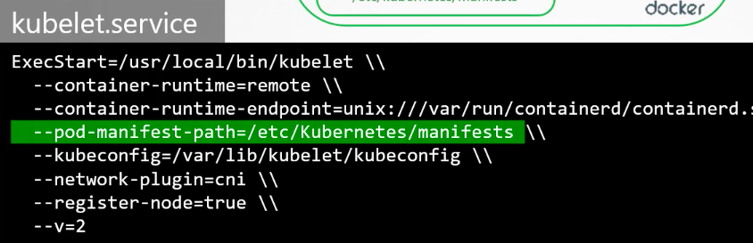

* We can also provide another method for the config file using using `--config=kubeconfig.yaml` and the path of this config file can be provided in the kubeconfig.yaml file as `staticPodPath: /etc/kubernetes/manifests`. Kubeadm uses this method.

* Once the configuration files are configured, then we can list the pods using `docker ps` command, as we dont have the control plane components to use the kubectl commands, we can use `docker ps` only.

* Remember, if there are also control plane components, then also kubelet can create pods. The kubelet can create pods from the kube-api server and also as static pods from the manifests file. Kube-api server is aware is aware of static pods and can be listed from the master node using the kubectl commands.  

* Multiple concepts has not been explained in this section, refer the video.


# Monitoring

* To get the metrics of pods and nodes use `metrics-server`
* Steps: 
    * `git clone https://github.com/kodekloudhub/kubernetes-metrics-server.git`
    * `cd kubernetes-metrics-server`
    * `kubectl apply -f .`
* Wait for 2mins to gather data for metrics-server, after 2mins, to get the metrics of pods and nodes use `kubectl top nodes` and `kubectl top pods` commands.

# Logging

* To get the logs of a particular pod that only has one container in it use `kubectl logs -f <pod-name>` command. NOTE: `-f` flag is for getting live logs ongoing.

* Additionally, if there are more than one container in a pod, use `kubectl logs -f <pod-name> <container-name>` 


# Application Lifecycle Management

* To check the status of the rollout deployment use `kubectl rollout status deployment/<deployment.name>` command.
* To get the revisions and history of the deployment use `kubectl rollout history deployment/<deployment-name>` command.
* Deployment Strategy
    * Recreate Strategy(Non-Default): Will kill all the older pods first, then creates the new updated pods with new revisions. (More Application Downtime)  
    * Rolling Update(Default): Will kill one older pod and then creates one new pod with new revisions, and so on for rest of the pods. (Less Application Downtime)
* To change the container/pod image using the imperative command use `kubectl set image deployment/<deployment-name> nginx=nginx:1.9.1`
* To get the events of the deployment use `kubectl describe deployment <deployment-name>` command.
* When a new deployment is created the replicaset which is associated with that new deployment can be called as ReplicaSet-1, so in this all our pods will be created for the first time. However, when we perform the rolling updates on the new deployment which was ReplicaSet-1, then the Kubernetes Cluster will create a second deployment with new replicaset named as ReplicaSet-2, and in this second deployment will create new pods with revisions of the application by deleting the first older pod and creating a new pod in ReplicaSet-2 and so on. We can check this new rolling deployment using `kubectl get replicasets` command. But if anything goes wrong in the we can rollback to the older deployment on ReplicaSet-1 using the `kubectl rollback undo deployment/<deployment-name>` command. To check the rollback is done on the older version use `kubectl get replicasets` command.

# Commands and Arguments

* In Docker, An ENTRYPOINT allows you to configure a container that will run as an executable. For example,

```dockerfile
ENTRYPOINT ["sleep"]  
CMD ["5"]
```

In the above dockerfile, entrypoint will run the executable which is sleep and CMD is the argument for that executable. However, the same concept in the Kubernetes is, ENTRYPOINT in kubernetes is `command` and CMD in kubernetes is `args` which can be mention like below example,

```yaml
spec: 
  containers:
    - name: ubuntu-sleeper
      image: ubuntu-sleeper
      command: ["sleep2.0"]
      args: ["10"] 
```

In the above yaml file, if we use the above docker file, which already has the ENTRYPOINT with sleep and cmd as 5, but in the yaml file we are overwriting this with the new version of sleep2.0 using `command` and arguments with 10 using the `args` command. 

# Environment Variables

* Plain Key Value
    * We can specify the plain text environment variables in the pod-definition yaml files as below:

```yaml
spec:
  containers:
    env:
    - name: APP_COLOR
      value: pink
```

* ConfigMap

```yaml
spec:
  containers:
    env:
    - name: APP_COLOR
      valueFrom:   
```
         
* Secrets

```yaml
spec:
  containers:
    env:
    - name: APP_COLOR
      valueFrom: 
```

# ConfigMaps

* To centrally manage the environment variables we can use ConfigMaps.

* Create ConfigMaps file and store the Environment Variables. There are two ways to create ConfigMaps: 
    * Imperative 
        * Use `kubectl create configmap` command to is the imperative way.
        * Complete command: 
          ```shell script
          kubectl create configmap \
          <config-map> --from-literal=<key>=<value>
          ```
        * Example: 
          ```shell script
          kubectl create configmap \
          app-config --from-literal=APP_COLOR=blue \
          --from-literal=APP_MOD=prod
          ```

        * We can also specify the file path in the imperative command, such as like this: 
          ```shell script
          kubectl create configmap \
          <config-name> --from-file=<path-to-file>
          ```
        
        * Example: 
          ```shell script
          kubectl create configmap \
          <app-config> --from-file=filename
          ```
        
        * Declarative  
          Creating ConfigMaps using the definition yaml files. Then use `kubectl create -f <configmap-definition.yml>` command.
          
          ```yaml
          apiVersion: v1
          kind: ConfigMap
          metadata:
            name: app-config 
          data:
            APP_COLOR: blue
            APP_MODE: prod
          ```
          Once the above file is created, use `kubectl create -f configmap.yml` command to create config map using declarative method.
          To list the configmaps use `kubectl get configmaps` command. To describe it use `kubectl describe configmaps` command.
          Now, to use these configmaps variables, we can inject them in the pod-definition.yml files, such as like this:
          ```yaml
          spec:
            containers:
              envFrom:
                - configMapRef:
                  name: app-config   #Here we have specified the metadata name of the configmap to use the configmap data.
          ```
          Now, create the pod, `kubectl apply -f pod-definition.yml file`
          
          We can also use configmaps as a single environment, such as like this:
          
          ```yaml
          spec:
            containers:
              env:
               - name: APP_COLOR
               valueFrom:
                 configMapKeyRef:
                   name: app-config
                   key: APP_COLOR   
          ```     
          
          We can also create a total file for environment variables and use it as a volume, such as like this:
          
          ```yaml
          volumes:
            - name: app-config-volume
              configMap:
                name: app-config
          ``` 
          
# Secrets

* In this, we can store our passwords and secrets, it is similar to configmaps but the secrets are encrypted.
* Two steps to create Secrets, first, Create a Secrets file and Second, inject them in the definitions file.
* Secretfile
```yaml
DB_Host: mysql
DB_User: root
DB_Password: password
```
* There are two methods to create Secrets:
    * Imperative
        * Using Imperative Command: `kubectl create secret generic \
          <secret-name> --from-literal=<key>=<value>`
        * Example: 
        ```shell script
        kubectl create secret generic \
        app-secret --from-literal=DB_Host=mysql \
        --from-literal=DB_User=root \
        --from-literal=DB_Password=password
        ```
        * By specifying file path of the secrets:
        ```shell script
        kubectl create secret generic \
        app-secret --from-file=<filename>
        ``` 
    * Declarative
        * In the declarative approach, we have to create secret-definition.yaml file.
        * First convert our passwords and credentials into encrypted base 64 format using the linux utility, such as like this:
          `echo -n password | base64`
        * Once we get the base64 encrypted format data, then we have to specify them in the file, such as below:
        ```yaml
        apiVersion: v1
        kind: Secret
        metadata:
          name: app-secret
        data: 
          DB_HOST: <base64-format>
          DB_User: <base64-format>
          DB_Password: <base64-format>
        ```    
        Now create the secret, use `kubectl create -f secret-definition.yml` command.
        
        * To list the secrets, use `kubectl get secrets`, to describe use `kubectl describe secrets` and to get the values as well of our secrets use `kubectl get secrets app-secret -o yaml`
        * To decrypte the base64 values, again use the linux utility such as like this: `echo -n <base64-code> | base64 --decode` 
        * Now, to call the secrets in the pod-definition yaml files use the below block:
        ```yaml
        spec:
          containers:
            envFrom:
            - secretRef:
                name: app-secret     # Specify the Secret metadata name, which is specified in the above secret yaml file, this will use all secrets from that file.
        ```
        Now, create the pod.
        
        * We can inject, Secrets for a single environment such as like this:
        ```yaml
        spec:
          env: 
           - name: DB_Password
             valueFrom: 
               secretKeyRef: 
                 name: app-secret
                 key: DB_password 
        ```
        * We can also create a file and make a whole volume of it and use it as a Secrets:
        ```yaml
        volumes:
         - name: app-secret-volume
           secret:
             secretName: app-secret
        ```

# Self Healing

* Kubernetes provides additional support to check the health of applications running within PODs and take necessary actions through Liveness and Readiness Probes. However these are not required for the CKA exam and as such they are not covered here. These are topics for the Certified Kubernetes Application Developers (CKAD) exam and are covered in the CKAD course.

# Cluster Maintenance

### OS Upgrade

* In this, if we require some nodes to be patched, upgrade or to do some maintenance tasks, that requires to take that node down from the Cluster and do our tasks and maintenance and then bring it back to the cluster again. For doing this process, perform the below steps.

*  For example, we have a node and we takes that node down manually or there is an issue has happened to that node and the node goes down, so in this case, if it comes automatically back within 5 minutes then the requests will be serve to the customers. But, if it does not comes back within 5 minutes then the pods are terminated from that node and Kubernetes considered them as dead pods. If the pods were part of the Replica Sets then they are recreated on the other nodes. Now, the Master node will wait for that terminated pod to come back, this time is called as  pod eviction timeout and is set to 5 minutes as default and it is configured in the controller manager. Further, when the terminated node comes back in the cluster after the pod eviction timeout which is 5 minutes by default, that node does not has any pods on it and comes totally blank. As we have seen, the node goes down for 5 minutes and it totally impacts our customer when the pods are on it goes down, but if the ReplicaSet is already their it will create that pod on other node, but however, it will still impact the customer, So to efficiently upgrade the nodes and perform the maintenance tasks perform the below steps.

* First Step: We have to purposely drain the node to other node, that means drain command will remove the pods from the current node and recreate the pods on the other node. This can be done using `kubectl drain <node-name>` command. Once, the node is drained it is cordoned or unscheduleable that means none of the pods will be scheduled on that node until we specifically remove the restriction. 

* Second Step: Once the first step is done, now we have to bring back that node to cluster using the `kubectl uncordon <node-name>`. Remember, when the Pod will come back to the cluster it will come blank it will not have any pods on it, we have to specifically create the pods on that node. Till here all the steps are done.

* Third Step: In this, if we want to make any node unshceduleable or cordon that means no new pods will be scheduled on it, then we can use `kubectl cordon <node-name>` command.


# Kubernetes Software Versions

* The ETCD and CoreDNS are separate projects of Kubernetes and hence they have their different release versions as compare to other Kubernetes Components.

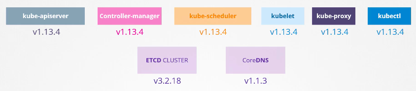


### Cluster Upgrade Process

* The Kube-Api Server will be higher version other than the control plane components. However, the kubectl can be higher than Kube-Api server.

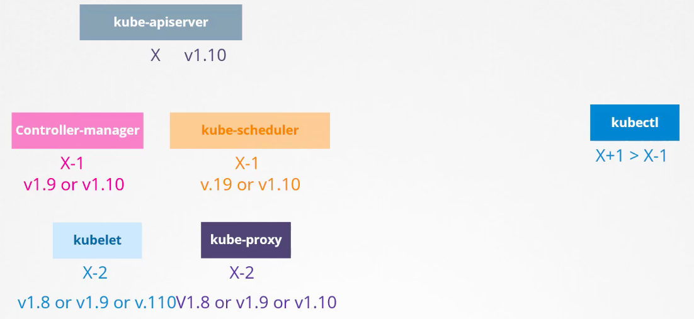

* We can upgrade component by component. Only three further minor updates is supported in Kubernetes. For example, if we are at v1.10, and Kubernetes has launched v1.11, v1.12, v1.13, v1.14, then we can only upgrade till v1.13 that means only three hops. Also we cannot directly go from v1.10 to v1.13, we have to upgrade step by step such as first upgrade will be on v1.11, then v1.12 and then we can go on v1.13.   

* The upgrade process is depend on how we have setup our cluster, such as we are using Cloud Platforms Kubernetes, then within few clicks we can upgrade the Kubernetes Cluster. But, we have setup using Kubeadm, then we can use `kubectl upgrade plan` and `kubectl upgrade apply` command. However, if we have setup our cluster using the Hardway, then we have to upgrade the cluster by upgrading each components separately.

* First will look using the Kubeadm, in kubeadm, there are one master and multiple worker nodes. First we will upgrade the Master node, however, if the Master node goes down while upgrading it will only take down the control plane components such as kube-api server, scheduler,etc but it will not take down worker nodes and our customer can access our applications. Once, the upgrade process is done the Master is back in the Cluster with the upgraded version. 

* Now we need to upgrade the worker nodes, there are multiple strategies for upgrading the worker nodes:

Strategy 1: In this, all worker nodes gets down and all are upgraded at once, but it will affect the customer briefly.

Strategy 2: In this, one by one worker nodes are taken down, not all at once. For first node, its pods are shifted to other node and the first node is upgraded, next second node and third node is upgraded.

Strategy 3: One new node is added in the cluster with new upgraded version of Kubernetes, and the older one is removed and its pods are shifted to the new upgraded node, likewise happens for other nodes.

* Steps to upgrade the Master Node:
    * Execute `kubeadm upgrade plan` command, this will provide us good details which are highlighted below.
      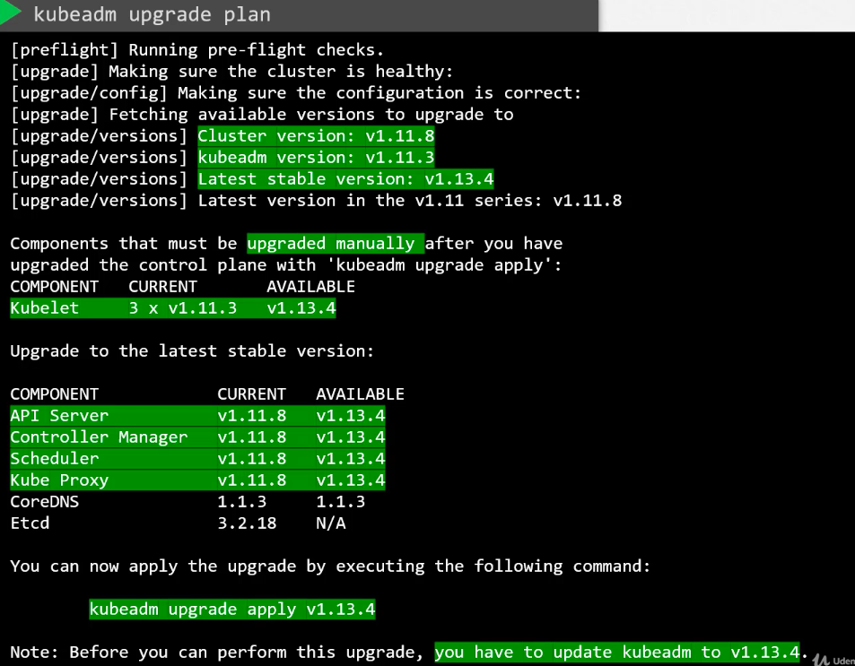
      
      However, we cannot directly upgrade from v1.11 to v1.13, first we have to upgrade to v1.12.
      
    * Now to upgrade the kubeadm tool itself from v1.11 to v1.12 using `apt-get upgrade -y kubeadm=1.12.0-00` command. Then upgrade the cluster using `kubeadm upgrade apply v1.12.0` command. Now our control plane components of Master node are upgraded to v1.12.0. However, if we execute `kubectl get nodes` command it will still show us the older version, this is because it is showing the kubelets version on each of these nodes registered with the api-server and not the api-server itself. 
    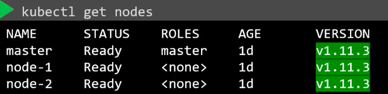
    
    * Depending on our setup, we may or may not have the kubelets installed on our Master node. But if the cluster is setup using the Kubeadm, then only we have the kubelets on our master nodes. Now to upgrade the kubelets on the Master node use `apt-get upgrade -y kubelet=1.12.0-00`, once its downloaded, restart the package using `systemctl restart kubelet` command. Now if we execute the `kubectl get nodes` we can see that out master is upgraded to newer version, see the below screenshot.
    
    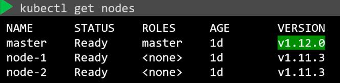
    
* Steps to upgrade Worker Node:
    * First we have to shift our pods from the first node to second node using the `kubectl drain node01` command. This command will shift existing pods to other nodes if the pods are in Replica Set. Once the pods are shifted to second node then the first node will go in the unschedulable state that means no new pods will be schedule on it. Next perform the below steps:
    
    ```shell
    apt-get upgrade -y kubeadm=1.12.0-00 
    apt-get upgrade -y kubelet=1.12.0-00
    kubeadm upgrade node config --kubelet-version v1.12.0
    systemctl restart kubelet
    kubectl uncordon node01   # This will make node01 schedulable again
    ```    
   
   * These are the steps for first worker nodes, do these for rest of the other worker nodes. However, its better to refer Kubernetes Official websites while performing upgrades.


# Backup and Restore Methods

* To get the yaml files of all the Kubernetes Cluster Resource we have created use `kubectl get all --all-namespaces -o yaml > filename.yml` command.

* To backing up the resources, the ETCD also stores the information of our cluster such as nodes and pods etc. To get the backup of our Cluster we can take the snapshot of the ETCD database using `ETCD_API=3 etcdctl snapshot save snapshot.db` command. We can check the snapshot.db file by using ls command. To check the status of the backup use `ETCDCTL_API=3 etcdctl snapshot status snapshot.db` command.

* If we want to restore the etcd snapshot backup, first we have to stop the kube-api server using `service kube-apiserver stop` command. Then execute the below command:

```shell script
ETCDCTL_API=3 etcdctl snapshot restore \
              --endpoints=https://[127.0.0.1]:2379 \
              --cacert=/etc/kubernetes/pki/etcd/ca.crt \
              --cert=/etc/kubernetes/pki/etcd/server.crt \
              --key=/etc/kubernetes/pki/etcd/server.key \
              --data-dir /var/lib/etcd-from-backup \
              --initial-cluster="" \
                  /opt/snapshot-pre-boot.db
```

# Security

### Security Primitives

* Root access based disabled, Password based authentication disabled and only SSH key based authentication to be made available.

* In the Kubernetes Cluster, the kube-api server is the whole and sole components which is important which has to be secured first.

* While securing kube-api server there are two important modules:    
    * Authentication (Who can access?)
        * Files - Username and Passwords
        * Files - Username and Tokens
        * Certificates
        * External Authentication providers - LDAP
        * Service Accounts
    
    * Authorization (What can they do?)
        * RBAC Authorization (Role Based Access Control)
        * ABAC Authorization (Attribute Based Access Control)
        * Node Authorization
        * Webhooks Mode      

* In cluster all components can securely communicate with each other using the TLS Certificates
* By default, all pods can access all other pods within the cluster. We can restrict access between them using the **Network Policies** 

### Authentication

* In this, we are going to discuss about securing access to Kubernetes Cluster with Authentication Mechanism.
* Cluster access mechanisms who access the cluster such as Users (Admins and Developers) and Service Accounts (Third Party Applications)
* All users access such as Admins and Developers are access by Kube-Api Server, whether we are using `kubectl` command or APIs such as `curl https://kube-server-ip:6443/` all these requests goto kube-api server. So first, kube-api server authenticates the requests and then process it.
* Kube-Api Server authenticates these users using the:
    * Static Password File
        * We can create a user information csv files which contains, username, password and userid. Such as below:
        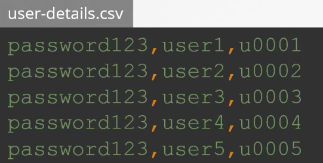
        * Once these file is created, then we can pass these file parameters to the Kube-Api Server service file such as like this `--basic-auth-file=user-details.csv`, then restart the Kube-Api Server for these options to take effect.
        * If we have setup cluster using the kubeadm tool then we have to specify these parameters in the Kube-Api service definition.yml file. Once we have mention in the yaml file, apply it to the service file using the `kubectl apply -f kube-apiserver.yml` command.
        * If we have to access kube-api service using the API then we have to specify the username and password in the API such as like this `curl -v -k https://master-node-ip:6443/api/v1/pods -u "username:password"`
        * We can also add our user to a group and these groups has to be specify in the user information csv file, such as like this:
        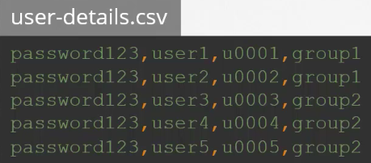
        
    * Static Token File
        * Similarly, we can create the Static Token File which contains the token, username, userid and groupname such as like this:
          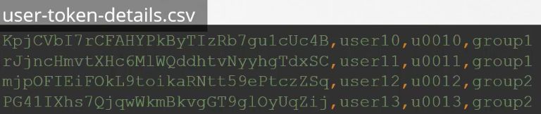
          Once, these file is created we can add these file as a parameter to the kube-api server such as like this `--token-auth-file=user-details.csv`.
        * While using the Tokens in the APIs we can use like this `curl -v -k https://master-node-ip:6443/api/v1/pods --header "Authorization: Bearer <token>"`

* However, this is not a recommended approach as we storing credentials and tokens in a plain text file.
* Consider volume mount while providing the auth file in a kubeadm setup
* Setup Role Based Authentication(RBAC) for the new users
* Check the Article on Setting up Basic Authentication in lecture 138.

    * Certificates
        * Remember, the public key has extensions such as .crt, .pem, etc and private key will have extensions such as .key, *-key.pem, etc. Note that the private key will have "key" keyword in them and public key will just have the .crt extension, remember this.
        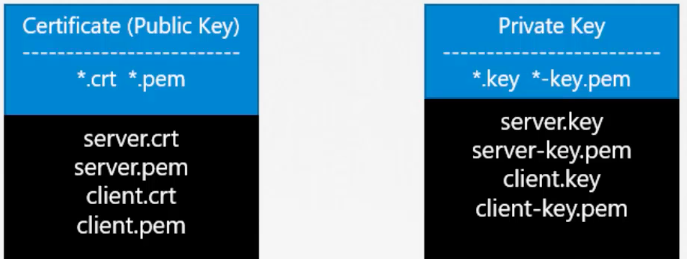
        
        * Remember the below figure keywords. Such as server.crt and server.pem are Server's public keys or certificates. Whereas, client.key or client.pem are Client's private keys.
        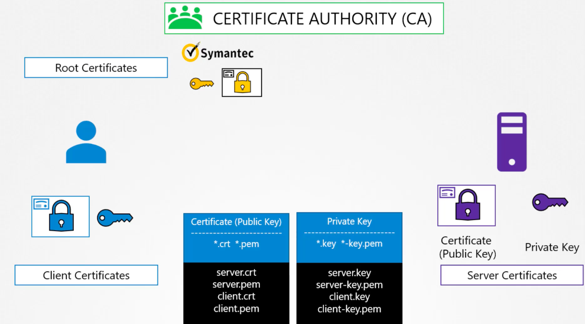
        
        * When we are trying to access the Kubernetes Cluster as a user, then that connection has to be secured, whereas when the Master node tries to connect with other Worker nodes that connection has to be secured, these connection can be secured using Server Certificates for Servers and Client Certificates for Clients.
        
        * Look the below figure, where clients and Kubernetes Components tries to communicated between each other using the public/certs and private keys. For more information look lecture 142.
        
        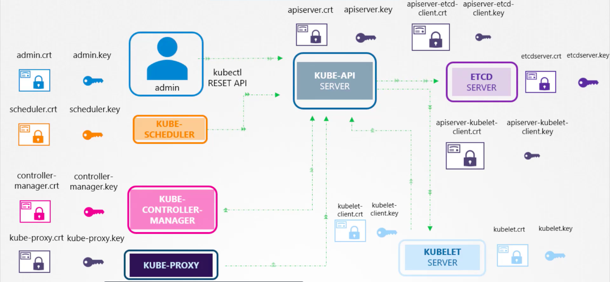
        
        * Certificate Creation can be done using multiple tools such as EasyRSA, OpenSSL and CFSSL.
        * But for now we will use OpenSSL.
        * For creating certificates for Certificate Authority (CA) we will use below steps:
            * To create Private Key use `openssl genrsa -out ca.key 2048` command
            * Then we create OpenSSL requests command along with the private key which is created to generate a certificate signing request `openssl req -new -key ca.key -subj "/CN=KUBERNETES-CA" -out ca.csr`
            * Finally, we sign the certificate using the `openssl x509 -req -in ca.csr -signkey ca.key -out ca.crt` command  
        * Now for creating certificates for Admin users :
            * Private key for admin users `openssl genrsa -out admin.key 2048`
            * Now, Certificate Signing Request `openssl req -new -key admin.key -subj "/CN=kube-admin" -out admin.csr`. We are creating certificate signing request by the name as `kube-admin`, it is not mandatory to have this name, However, with this name the kubectl client authenticates with and in the audit logs we will see `kube-admin` name so that is the reason provide better name so that we can get to know that this is the name we have assign to certificate signing request.
            * Finally, generate the signed certificate using `openssl x509 -req -in admin.csr -CA ca.crt -CAkey ca.key -out admin.crt` command. Remember that, we provided the Certificate Authority ca.crt(public key) and ca.key(private key) to validate the certificate within our cluster. This makes this certificate a valid certificate. The signed certificate is output to admin.crt, this admin.crt will be use by the admins to access the Kubernetes cluster. If we want to add our user group details as well in the admin.crt then we have to pass additional parameters in the Certificate Signing Request of Admins Users, such as like this `openssl req -new -key admin.key -subj "/CN=kube-admin/O=system:masters" -out admin.csr`. Here, we can differentiate the admins users with other users by provising the group details such as we have provided in the last command, the group name is `system:masters`.
            * Now as Admins, we can use certificates to access the Kubernetes Cluster such as like this
            ```shell script
            curl https://kube-apiserver:6443/api/v1/pods \
            --key admin.key \
            --cert admin.crt \
            --cacert ca.crt
            ```
            * The other method is to create kube-config.yml file in which we will include our certificate names such as like this
            ```yaml
            apiVersion: v1
            clusters: 
            - cluster: 
                certificate-authority: ca.crt
                server: https://kube-apiserver:6443
              name: kubernetes
            kind: Config
            users: 
            - name: kubernetes-admin
              user: 
                client-certificate: admin.crt
                client-key: admin.key
            ``` 
            We will look kube-config in more depth further.
            
            *  Remember, we should have Certificate Authority root certificates to validate the clients and servers certificates, so the CA               root certificates should be stores in the clients and servers side as well.
            
            * Next, for ETCD server, if we have a mutiple ETCD cluster running as a high-availability environment. So to communicate between             these ETCD peers, we have to generate additional peer certificates to communicate between ETCD cluster each other. Once these are generated we have to specify them in the etcd.yml file 
            
            * Next, for Kube-Api server, look the lecture 143.
            * Next for Kubelet as well
            
            * Certificate Details: In this, to check the certificate details it depends on the setup which we have used for the Kubernetes              Cluster. Such as the Hard Way or using the automated method Kubeadm. In this we will look the cluster which is setup using the            Kubeadm. 
                * In kubeadm setup, look the `/etc/kubernetes/manifests/kube-apiserver.yml` file, in which it will contains all the                         certificates which are configured in the Kubernetes Cluster. Use the `openssl x509 -in <certificate-path> -text -noout`                   command to decrypt the certificate. This will provide you all the informations of the certificate. So this procedure for                  all certficates which are configured in the kube-apiserver.yml file.
                
                * For troubleshooting the issues related to certificates it also depends on the Kubernetes Cluster Setup which is The Hard                  Way and Kubeadm tool.
                    * For the Hard Way use `journalctl -u etcd.service -l` command
                    * For the kubeadm cluster setup use `kubectl logs etcd-master` command
                    * If the control components such as Kube-Api server or ETCD cluster is down, then `kubectl` command will not work, if                       this happens try `docker ps -a` command, grab the control plane components docker id and check the logs using `docker                     logs <docker-id>`  
                    
            * **Certificate APIs**     
                * Whenever we creates a new user, every time we have to take the new user private key and send it to the CA(Certificate Authority) server for signing it. In Kubeadm, the CA server is                  located in the Master Node by default, as while installing the Kubernetes Cluster, it stores all its certificates on the Master Node.
                * As we can see its okay for one user, but if there are multiple users then every time for providing the signing certificates the Admin has to login in the Master Node every time and                  has to be done the signing certificates process. However, this can be automated using the **Certificate API**.
                * The Certificate Api provides us an automated way, here are the below steps we can do the signing certificates using the Certificates Authority:
                    * When the Admins receives the certificate signin requests from other users, it can generate *CertificateSigningRequest* Object, once the request is created then it can be reviewed                     and approved using the kubectl command, these Certs are then shared with the Admins and can be extracted and can be send to the requested user.
                        * A non-admin user first generates a private key using `openssl genrsa -out username.key 2048` command
                        * Then the request is send to Admin, then Admins takes that key and generate a certificate signin request(csr) using below steps:
                            * `openssl req -new -key username.key -subj "/CN=jane" -out username.csr`
                            * `cat username.csr | base64`
                            * The Certificate Signing Request is just like the other objects in the Kubernetes which we creates using the definition.yml files.
                              ```yaml
                              apiVersion: certificates.k8s.io/v1beta1
                              kind: CertificateSigningRequest
                              metadata:
                                name: username
                              spec:
                                groups: 
                                - system:authenticated
                                usages: 
                                - digital signature
                                - key encipherment
                                - server auth
                                request:    
                                    <username.csr with base64 encrypted>
                              ```  
                            * To get the request `kubectl get csr`
                            * To approve certificate `kubectl certificate approve username`
                            * To view the certificate `kubectl get csr username -o yaml`, copy the certificate
                            * To decrypt it use `echo "<copied-certificate>" | base64 --decode`
                            * Share the decrypt certificate with non-admin user.  
                    
                        * NOTE: All Certificate related operations are carried out by the Controller Manager which are named as `CSR-APPROVING` and `CSR-SIGNING`. The CA server root certificates,                             server certificates and private key are configured in the `/etc/kubernetes/manifests/kube-controller-manager.yml` file.
            
### KubeConfig

* Use kubeconfig files to organize information about clusters, users, namespaces, and authentication mechanisms. The kubectl                command-line tool uses kubeconfig files to find the information it needs to choose a cluster and communicate with the API                 server of a cluster.
            
* Note: A file that is used to configure access to clusters is called a kubeconfig file. This is a generic way of referring                 to configuration files. It does not mean that there is a file named kubeconfig.

* By default, kubectl looks for a file named config in the $HOME/.kube directory. You can specify other kubeconfig files by                 setting the KUBECONFIG environment variable or by setting the --kubeconfig flag. If we want to create out custom                          kubeconfig file then every time when we use `kubectl get pods` we have to specify the kubconfig file such as this
`kubectl get pods --kubeconfig <filename>`, but its easy to keep the kubeconfig file inside the $HOME/.kube directory as we dont have to specify the kubeconfig file name everytime for listing the pods it will take that file by default.
     
* The KubeConfig file has specific sections as below:
    * Clusters: These are Kubernetes Cluster which we require to access to do some operations, such as Development, Staging and Production, etc. 
    
    * Users: Users are the actual users in our Organizations who access the Cluster such as Admins, Developers, etc. These users will have different privileges on different clusters. 
     
    * Contexts: Contexts acts as a mediator between Users and Clusters. It specifes which User can access which Cluster. We can specifically provide the User access to particular Cluster. For example, we can specify Admins can access Production cluster and can be specify such as like this `admins@production`. From this method, we dont have to specify the certificate everytime for accessing the clusters and becomes easy and handy to work on the Clusters.
    
    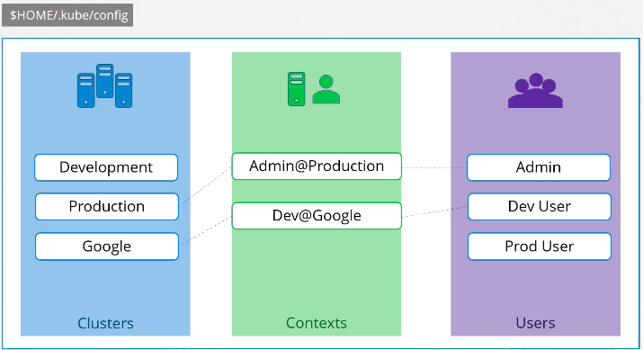
    
    Below is the actual format of the KubeConfig file.
    
```yaml
apiVersion: v1

kind: Config 

current-context: developer-user@development-cluster 

clusters: 

- name: development-cluster
  cluster: 
    certificate-authority: /etc/kubernetes/pki/ca.crt
    server: https://development-cluster:6443  

- name: production-cluster
  cluster: 
    certificate-authority: /etc/kubernetes/pki/ca.crt
    server: https://production-cluster:6443  

contexts: 

- name: developer-user@development-cluster
  context: 
    cluster: development-cluster
    user: development-user
    namespace: development

- name: production-user@production-cluster
  context: 
    cluster: production-cluster
    user: production-user
    namespace: production

users: 
- name: developer-user
  user: 
    client-certificate: /etc/kubernetes/pki/users/developer.crt 
    client-key: developer.key

- name: production-user
  user: 
    client-certificate: /etc/kubernetes/pki/users/production.crt 
    client-key: production.key

```

As here we have multiple users and multiple clusters, but how we can define to use which Context as default, this can be set using 
the `current-context` which is specified in the above yaml file. So the default Context which will be used is `developer-user@development-cluster`.

* There are `kubectl` commands to perform operations on the kubeconfig file, such as below:
```shell script
kubectl config view
kubectl config view --kubeconfig=<custom-kubectl-file>  # To view custom config file
kubectl config use-context production-user@production-cluster # If we want to change the current context to production, this will also update the kubeconfig file as well
kubectl config -h    # For more options
```

* We can have multiple Namespaces within a Cluster, we can also configure KubeConfig Contexts to a particular Namespace, see the above yaml file.

* We have also defined certificates in the above yaml file, we have specified full-path as its good to specify that way. Or we can also directly paste the certificate in the kubeconfig yaml file but it should be base64 encoded, this can be done by using `certificate-authority-data` instead of `certificate-authority`

### API Groups

* URLs and APIs
    * To get the Kube-Api server information use `curl http://kube-master:6443/version`
    * To list the pods use `curl https://kube-master:6443/api/v1/pods`

* Our focus in this section is on  these paths:
    * `/version` - Checking the cluster api version 
    * `/metrics` and `/healthz` - To monitor the health of the Cluster
    * `/logs` - Integrating with third party applications for logging purpose
    * But the important ones are `/api` and `/apis`, these are categorise as groups `/api` is for core group and `/apis` as named group. 
        * `/api` core group is where core functionalities exist such as namespace, pods, rc, events, nodes, endpoints, services, etc
        
            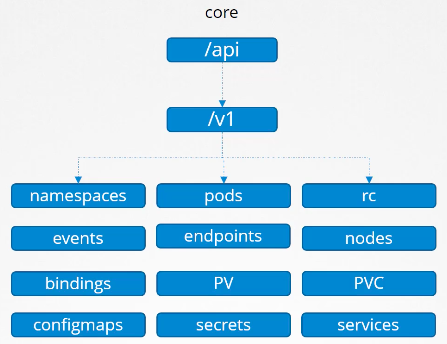
        
        * `/apis` named group are more organised and in future all the newer feature will be made available using this named group. In this,         there are multiple groups such as `/apps`, `/extensions`, `/networking.k8s.io`, etc.
        
            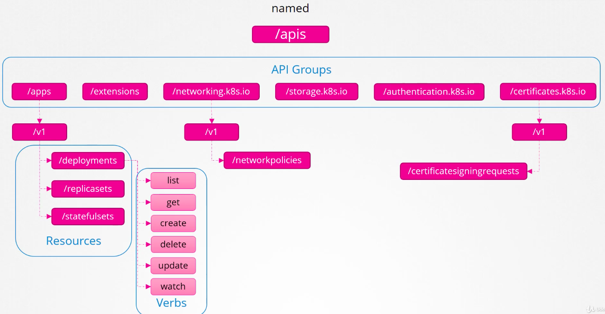
            
            The Kubernetes API reference page can show us the difference between these two groups.
* We can also list these two groups using the CLI, use `curl http://localhost:6443 -k`. Rememer, while using this CLI first we have to specify our certificates to authenticate us in the API or else it will show the Forbiddenn Error.

* Other method to access the Kube-Api server is using the Kubectl-Proxy client, this will launch a service on port 8001 and uses credentials and certificates from our kubeconfig file to access the kube-api server. Use below steps to perform this: 
    * `kubectl proxy`
    * `curl http://localhost:8001 -k`
    
* Here are two terms that looks same which are `kube proxy` and `kubectl proxy`. Actually, they are not the same. The kube proxy is used to enable connectivity between pods and services across differents nodes within the cluster. Whereas, kubectl proxy is a http proxy service created by kubectl utility to access the kube-api server.

### RBAC (Role Bases Access Controls)

* Roles and Roles Bindings are created within a Namespace.

* To create a Role we can do it by creating Objects using the role-definition.yml file. Such as below:
```yaml
apiVersion: rbac.authorization.k8s.io/v1
kind: Role
metadata:
  name: developer
  namespace: default
rules:

- apiGroups: [""] # "" indicates the core API group
  resources: ["pods"]
  verbs: ["get", "watch", "list"]
  resourceNames: ["pod1", "pod2"]  # (Optional) - We can restrict access for a user to access specified pods only

- apiGroups: [""] # "" indicates the core API group
  resources: ["ConfigMap"]
  verbs: ["create"]

```

* Now to create the role use `kubectl create -f role-definition.yml` command.

* Now to attach these role to a user, create a binding-definition.yml file, such as below:
```yaml
apiVersion: rbac.authorization.k8s.io/v1
kind: RoleBinding
metadata:
  name: devuser-developer-binding
  namespace: default
subjects:
- kind: User
  name: dev-user
  apiGroup: rbac.authorization.k8s.io
roleRef:
  kind: Role 
  name: developer # this must match the name of the Role or Namespace Role you wish to bind to
  apiGroup: rbac.authorization.k8s.io
```

* Roles and RolesBindings commands:

```shell script
kubectl get roles   #list the roles
kubectl get rolebindings  # list the role bindings
kubectl describe role <role-name>  # More information for a role
kubectl describe rolebindings <rolebindings-name>  # More information for a rolebindings
```

* To check access for current users or different users:
```shell script
kubectl auth can-i create deployments  # Checking permissions for existing user to create deployment
kubectl auth can-i delete nodes      # Checking permissions for existing user to delete node
kubectl auth can-i create deployments --as <username>  # Checking permissions for other user to create deployments
kubectl auth can-i create pods --as <username>    # Checking permissions for other user to create pods
kubectl auth can-i create pods --as <username> --namespace <namespace-name>   # Checking permissions for other user in other namespace to create pods  
```

### Cluster Roles and Cluster RolesBindings

* Remember Resources can be categorized only as Namespaced and Clustered.
* To check which resources comes under Namespace use `kubectl api-resources --namespaced=true` and to check the resources that comes under the cluster use `kubectl api-resources --namespaced=false` 
* In the previous section we checked the roles and roles bindings for accessing resources under namespaces. 
* In this section, we will check the clusterroles and clusterbindings to access resources that are cluster scoped.
    * Cluster Roles 
        * Cluster Roles are just like Roles just the difference is that Cluster Role are used to create resources that comes under cluster          such as  Nodes, Volumes, etc.
        * For example, a clusterrole can be created for performing administrator tasks such as creating, deleting and listing the nodes in a        cluster. Such as below example:
          ```yaml
          apiVersion: rbac.authorization.k8s.io/v1
          kind: ClusterRole
          metadata:
            namespace: default
            name: cluster-administrator
          rules:
          - apiGroups: [""] # "" indicates the core API group
            resources: ["nodes"]
            verbs: ["get", "list", "create", "delete"]
          ```
          Then create the Cluster Roles using `kubectl create -f clusterrole-definition.yml`
        * Now, we have to attache this Cluster Role to a User using the ClusterRole Binding. Such as below:
          ```yaml
          apiVersion: rbac.authorization.k8s.io/v1
          kind: ClusterRoleBinding
          metadata:
            name: cluster-admin-role-binding
            namespace: default
          subjects:
          - kind: User
            name: cluster-admin
            apiGroup: rbac.authorization.k8s.io
          roleRef:
            kind: ClusterRole 
            name: cluster-administrator      # this must match the name of the ClusterRole you wish to bind to
            apiGroup: rbac.authorization.k8s.io
          ```
          Now create the ClusterRole Binding using `kubectl create -f clusterrolebinding.yml`
          
        * Whereas, a different clusterrole can be created for performing storage tasks such as creating, deleting, and listing persistent           volumes in a cluster.
        * Remember, ClusterRole is created for all namespaces as well, they are namespace wide. But Namespace role will only work within            that namespace only.
        
### Securing Images

* To store the docker hub credentials in the Kubernetes Cluster, perform below steps:
```shell script
kubectl create secret docker-registry regcred \    # docker-hub creds are stored in the kubernetes secrets
  --docker-server=<registery-name> \
  --docker-username=<registry-username> \
  --docker-password=<registry-password> \
  --docker-email=<registry-email>
```

Once, secrets are stored, specify them in the nginxpod-definitio.yml file, such as below:

```yaml

apiVersion: v1
kind: Pod
metadata:
  name: nginxpod
spec:
  containers:
   - name: nginxcontainer
     image: <registry-name>/<image-name>
  imagePullSecrets:
   - name: regcred 
```
These credentials are then used by kubelets to pull the images on worker nodes and creates a pod.


### Security Contexts

* If we want to run some commands inside the container using the users which are residing inside the container then we can use `securityContext` for that.

* For example,

```yaml

```

* We can configure the security level such on pod level as well as on container level. While creating pods we can specify the user id for that pod, that means all the containers within that pod, will use that specific user id for executing the specified commands and if we have to apply some linux capability we can add that as well.  
 
 * If we specify on the container level, the user id specified in that container level, that user within that container only can run the commands.
 
 * Remember that, if we specify the user id on pod level as well as on container level, the container level user id will overright the pod user id and its commands as well.
 
 * On the pod level, it is done such as below:
 
 ```yaml
apiVersion: v1
kind: Pod
metadata:
  name: nginx-pod
spec:
  securityContext:
    runAsUser: 1000  # This user id is resided inside the container, that means there is a user inside the container with this user id that will execute the below commands which is sleep.
  containers:
    - name: ubuntu
      image: ubuntu
      command: ["sleep", "3600"]  
```

* On container level, it is done such as below:

```yaml
apiVersion: v1
kind: Pod
metadata:
  name: nginx-pod
spec:  
  containers:
    - name: ubuntu
      image: ubuntu
      command: ["sleep", "3600"]  
      securityContext:
          runAsUser: 1000    # This user will only use in this particualar container only, same goes with the capabilities.
          capabilities: 
            add: ["MAC_ADMIN"] 
```
 * Using capabilities gives a binary root permissions for only a limited set of systems calls. So even if there would be a software leak, it may not even be abused. For example the ping command in this article. This command would not be able to change ownership of a file, with the chown system call, where a setuid binary would have been.
 
### Network Policy

* Remember this below diagram. Will explain it later.

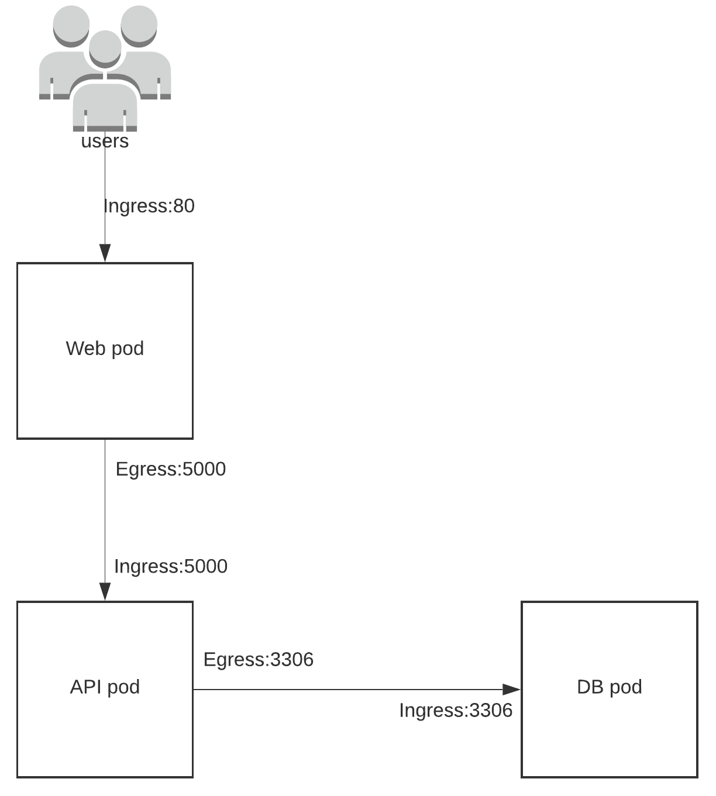

* In Kubernetes Cluster, by default all pods can access to each other even though they are residing on other nodes.

* In the above architecture, the Api pod should be the only one to access the DB pod, but by default in the Kubernetes Cluster the Web pod can access to DB pod, but we have to restric this. This Pod restriction to access other pods on network can be done using the **Network Policy**. 

* With the help of Network Policy, we can configure the DB pod to receive the ingress traffic from the API pod on port 3306 only. It will not recieve any traffic other than the API pod on Port 3306. 

* Perform the below steps to achieve this:
    * Label the pod with role: db such as like this
    ```yaml
    metadata:
      name: dbpodname
      labels:
        role: db
    ```
    
    * Create the Network Policy using the dbpod label, in below yaml script, the db pod will only recieve the ingress traffic from       api pod.
    ```yaml
    apiVersion: networking.k8s.io/v1
    kind: NetworkPolicy
    metadata: 
      name: db-networkpolicy
    spec: 
      podSelector:
        matchLabels:
          role: db     # dbpod will receive
        policyTypes:
        - Ingress      # the Ingress Policy Type
        ingress:
        - from: 
          - podSelector:
              matchLabels:
                name: api-pod   # From api pod
          ports:
          - protocol: TCP
            port: 3306       # On port 3306
    ```
     Now, create the network policy `kubectl create -f networkpolicy.yml`
     
     * Network Policy can only be supported on:
        * Kube-router
        * Calico
        * Romana
        * Weave-net
     
     * Network Policy is not supported on:
        * Fannel         

# Storage

### Docker Storage

In Docker Storage there are two types of storage such as: 

* Storage Drivers: Storage Drivers are handled by storage drivers plugins.
    * AUFS (Default driver for Ubuntu)
    * ZFS
    * BTRFS
    * Device Mapper
    * Overlay
    * Overlay2
    
* Volume Drivers
    * Volume Drivers are handled by volumes drivers plugins.
    * It stores the volumes 
    

* There are two types of mounts:
    * Volume Mount
    Volume Mount mounts a directory of the docker volume on the volumes directory, which is in /var/lib/docker/volumes.
    * Bind Mount
    Bind Mount mounts a directory  of the docker volumes on anywhere where the volume or data is residing such as external directories, EFS, etc.
# IMPORTANT COMMANDS

* To modify the existing replicasets image use `kubectl edit replicaset replicaset-name` command. Modify the image name and then save the file.

* To create a pod with image and labels attached: `kubectl run nginx --image=nginx --labels=tier=db`

* To create a service for existing running pod: `kubectl expose pod nginx --name nginx-service --port 80 --target-port 80`

* To list the nodes with their labels: `kubectl get nodes <node-name> --show-labels`

* To label existing nodes: `kubectl label nodes <node-name> key=value`

* To change the container/pod image using the imperative command use `kubectl set image deployment/<deployment-name> nginx=nginx:1.9.1`

* Ports
    * Kube-Api Server: 6443
    
* URLs and APIs
    * To get the Kube-Api server information use `curl http://kube-master:6443/version`
    * To list the pods use `curl https://kube-master:6443/api/v1/pods`
    
* kubectl exec -it ubuntu-sleeper -- date -s '19 APR 2012 11:14:00'
