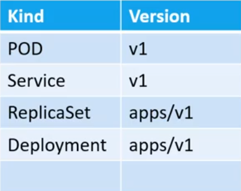

#Kubernetes Commands and Steps.

##Install Minikube for Single Node Cluster


1. Check the virtualization is enable or not by using below command, it the output is blank than the virtualization is enabled.

```bash
grep -E --color 'vmx|svm' /proc/cpuinfo
```

2. Install Docker. 

```bash
sudo apt install docker.io -y
```

3. Install kubectl on Linux.

Download the latest release with the command:

```bash
curl -LO "https://storage.googleapis.com/kubernetes-release/release/$(curl -s https://storage.googleapis.com/kubernetes-release/release/stable.txt)/bin/linux/amd64/kubectl"

```


- Make the kubectl binary executable.

```bash
chmod +x ./kubectl
```

* Move the binary in to your PATH.

```bash
sudo mv ./kubectl /usr/local/bin/kubectl
```

* Test to ensure the version you installed is up-to-date:

```bash
kubectl version --client
```

4. Install Minikube

* Download a stand-alone binary

```bash
curl -Lo minikube https://storage.googleapis.com/minikube/releases/latest/minikube-linux-amd64 \
  && chmod +x minikube
```

* Add the Minikube executable to your path

```bash
sudo mkdir -p /usr/local/bin/
sudo install minikube /usr/local/bin/
```

* Start the Minikube and check the status

```bash
minikube start --vm-driver=none
minikube status
```


##Kubeadm for Multi-node cluster

1. Create three EC2 t2.medium instances and set their hostname using using the root user. One Master node and two worker nodes.

2. Install Docker on all three servers using Official Website. First check which Docker Versions are recently supported by the Kubernetes and install only that Docker version.

3. Install Kubeadm, Kubelet and Kubectl and all three servers. Check the Official Website and use the below commands to install. 

```bash
sudo apt-get update && sudo apt-get install -y apt-transport-https curl
curl -s https://packages.cloud.google.com/apt/doc/apt-key.gpg | sudo apt-key add -
cat <<EOF | sudo tee /etc/apt/sources.list.d/kubernetes.list
deb https://apt.kubernetes.io/ kubernetes-xenial main
EOF
sudo apt-get update
sudo apt-get install -y kubelet kubeadm kubectl
sudo apt-mark hold kubelet kubeadm kubectl
```

4. Initialize the master node.

```bash
sudo kubeadm init --pod-network-cidr=10.244.0.0/16 --apiserver-advertise-address=<master-private-ip>  #pod network cidr is the range of our pod network.
```

Once the above command is executed it provides three commands to execute after that, execute as well and store the kubeadm token somewhere.

5. Installing a pod network

```bash
kubectl apply -f https://raw.githubusercontent.com/coreos/flannel/master/Documentation/kube-flannel.yml
```

6. To check the all pods running in all namespaces.

```bash
kubectl get pods --all-namespaces
```

7. Now, join the worker nodes to the master node. The below command will get after initializing the master node on the terminal. Be sure to store that token command and use it for joining the worker nodes to the master node.

```bash
sudo kubeadm join ip-address:port --token xxxxxxx \
    --discovery-token-ca-cert-hash xxxx:xxxxxxx
```


8. Check the worker nodes.

```bash
kubectl get nodes
```

9. Create sample nginx pod, list it and delete it.

```bash
kubectl run nginx --image=nginx
kubectl get pods  #list pods and some details
kubectl get pods -o wide  #list pods with addtional details with IP and worker node location.
kubectl delete pod/nginx
kubectl describe pods  #get more information on the pod
```


##YAML in Kubernetes

Kubernetes uses YAML files as an inputs for the creation of objects such as POD's, replicas, deployments and services. All of these objects follow similar structure in Kubernetes 
definition file that always contains 4 top level fields.

For example: If we take the POD object then refer this yaml file sample-nginxpod.yml
Explanation for each fields.

1. apiVersion: API version of the Kubernetes API for creating objects.

2. kind: The type of object which has to created which in this example is POD. The other possible values are shown in the below image 1.

3. metadata: It is the data about the object whereas in this case the POD name and labels. By specifying the name and labels such as app and type will help us when there is a big architecture which contains 100s and 1000s of pods. So in this case we can filter the PODs using its name and labels. In labels we can add our customise type but other than the labels we cannot customize the key and value.

4. spec: In this, we have to specify the PODs specifications. Such as container count, name, image, etc.

Now, using the below command we can create, list and get some information of a POD.

```bash
kubectl create -f pod-definition.yml	
kubectl get pods
kubectl describe pod myapp-pod
```





##Replication Controller (Old Method)

+ Replication controller is the brain of the Kubernetes. It is needed for keeping the pod highly available if POD goes down. Even if there is one container running in a POD, the replication controller will keep that one count every time if one container fails it will switch on one container again in that same POD. Same goes with the POD which has more than one container.

+ Replication controller also balances the load between multiple pods. Even if a single node is out of resources, the replication controller will spin-up a new node and will deploy the same pods and container to balance the load and to serve the users or customer. That means it also scales the pods, container and nodes as well.

+ The sample file for the replication controller is stored in ./yaml-files/sample-rc.yml

Now create the replication controller and list the replication controller using the below commands:

```bash
kubectl create -f sample-rc.yml
kubectl get replicationcontroller
kubectl delete replicationcontroller myapp-rc
```

##Replica Sets (New Method)

+ The main difference between Replication Controller and ReplicaSet is that, Replication Controller manages all the pods which matches the labels as same we defined in the metadata of the pod. For example, if there is a pod which was not created by the Replication Controller but it has the same label as the Replication Controller pods, then the Replication Controller will take that standalone pod which was not created by it under the Replication Controller. However, this issue can be overcome by the Replica Set as we can specify the selector module in the Replica Set and take pods only which are mentioned in the Replica Set yaml file. We can specify multiple filters in the Replica Set that are not present in the Replication Controller.

+ The API version for the Replica Set is apps/v1 

+ See the ./yaml-files/sample-rs.yml file for how to specify the selector module.

Use the following command for creating, listing, describing and deleting the replica set.

```bash
kubectl create -f sample-rs.yml
kubectl get pods
kubectl describe replicaset/myapp-replicaset
kubectl delete pod podname  #Delete one pod from that three pods and check whether replica set create another pod automatically or not.
kubectl delete replicaset myapp-replicaset
```

###Scaling a Replica Set

+ As we have created 3 pods in the above Replica Set, now lets assume now we have to scale the Replica Set with total 6 pods. So there are multiple ways to do it. 

+ Such as will directly open the replica set yaml file(sample-rs.yml) and will replace the 3 number with 6. Now to update the replica set use the below command. 

```bash
kubectl replace -f sample-rs.yml  #This command will update the replica set capacity to 6. This is best method as this will also update the sample-rs.yml file with the actual count.
```

+ There are two other ways to do it are as follows:

```bash 
kubectl scale --replicas=6 -f sample-rs.yml  #NOTE: This will update replica set to 6 but in the sample-rs.yml file the count will be 3. So this is not the best method.

kubectl scale --replicas=6 replicaset <replica-set-name>  #NOTE: This will update replica set to 6 but in the sample-rs.yml file the count will be 3. So this is not the best method.
```

NOTE: Once we create a ReplicaSet pods and after that if we try to create a new pod without a ReplicaSet with the same label as the Replicas Set, the ReplicaSet will detect that pod and will delete it.
      But if we create a pod without a ReplicaSet with a different label the ReplicaSet will detect it and will check if the labels are same, if not the ReplicaSet will not delete that pod.
 
##Deployments

As new version comes of the application that is from version 1 to version 2. Now we have update our containers or pods to the new version. Kubernetes does not deploys the
new version of an application all at one time. Instead of that it will deploy the new version of the application to all the containers one by one that is called as Rolling
Updates. If any of the update goes wrong or failed, the Kubernetes can also perform the rollback update to the previous version. If we want to pause the deployments for any 
modifications if needs to be performed than with the help of Kubernetes Deployments we can do that as well.


 
See the sample-deployment.yml file that creates a deployment pods. Use the below command to create and list the deployments.
 
```bash
kubectl create -f sample-deployment.yml
kubectl get deployments
kubectl get all
kubectl delete deployments myapp-deployment 
```

If we are using Kubernetes in Production Environment, then will not create any yaml files for Pods and ReplicaSet. There will be only deployment yaml file which will contain our deployment metadata, 
specification for the pods and ReplicaSet count and details.

#Rollouts and Versioning in Deployment

When we first create a deployment it triggers a rollout a new rollout creates a new deployment revision. Let's call it revision 1.
In the future, when the application is upgraded meaning when the container version is updated to a new one a new rollout is triggered and a new deployment revision is created named revision 2.
This helps us to keep track of then changes made to our deployment and enables us to rollback to a previous version of deployment if necessary.


```bash
kubectl rollout status deployment/myapp-deployment   #To check the status of the rollouts
kubectl rollout history deployment/myapp-deployment  #To see the revisions and history of the rollouts
```

And if we want to track the revision use the `kubectl rollout status deployment/myapp-deployment --record` this flag will keep track of the revisions and can be seen using the
`kubectl rollout history deployment/myapp-deployment` command. 
 
 #Deployment Strategy
 
 There are two deployment strategies: 
 
 1. The Recreate Strategy
 
 For example, there are 5 nginx Pods are running, and now this nginx application has to be updated with the new application version. The Recreate Strategy will delete all the 5 nginx Pods
 and will create 5 new nginx Pods. This strategy will cause application down issue and will affect the users and customers. Thankfully, this is not the default Deployment strategy.
 
 2. The Rolling Update Strategy
 
 If we consider the same example, in this strategy, the Rolling strategy will not delete all the 5 nginx Pods directly. Instead, it will delete and one Pod and will create a new Pod with 
 the new nginx application version. This process will go till the 5 Pods one by one and will deploy the new nginx version seamlessly. This is the default Deployment Strategy.
 
 Now, we have already created a Deployment definition yaml file which is sample-deployment.yml. So in this file we will update the nginx container image version. 
 See the updated Deployment file.
 
 Now, to update the deployment with the new container image use the below command.
 
 ```bash
kubectl apply -f sample-deployment.yml  #This is the best method, as the definition yaml file will also contain the track of the version.

kubectl set image deployment/myapp-deployment \   #This is not the best method as we are updating using the CLI and it will not keep track in the definition yaml file.
     nginx=nginx:1.7.1

```
 
When we update the deployment it has created a new nginx:1.7.1 version container or Pods. While creating this, the deployment strategy which is Rolling Update strategy has created a
new three containers and has deleted the old three Pods which were running on the nginx normal image. This can be seen in using the `kubectl get replicasets` which will display the
old replicasets which is deleted and new replicasets which has created.

Next, to undo the deployment or to rollback to the previous version of the nginx application use the `kubectl rollout undo deployment/myapp-deployment` command which will delete the
new launched Pods and will launch the new Pods with the older nginx application version. After rolling back to the older version we can again use the `kubecetl get replicasets` 
which will show the older version running and new version deleted.

Creating the definition YAML file is recommended by the Kubernetes itself. Remember the first command which we used for creating the nginx pod which was 
`kubectl run nginx --image=nginx`. This command is not the best practice for creating the Pod, but in the backend it creates the deployment of this Pod only. But instead of using 
the CLI command use the definition YAML files to create the deployments of the Pods which is best practice.


## Services

* Kubernetes Services enable communication between various components within and outside of the application. 
* Kubernetes Services helps us connect applications together with other applications or users.
* For example, our application has groups of pods running various sections such as group of pods for serving front-end to the users. Other group of pods for running backend
processes and third group connecting to external data source.
* It is Services that enables connectivity between these groups of pods. Services enable the front-end application to be made available to end users. It also helps
for front-end and backend pods to make communication between each other and also helps in establishing connectivity to an external data source. Thus microservices enable loose
coupling between micro-services in our application. 
 


* For example for clear understanding. Let check our current architecture which we have deployed on the AWS EC2 instances.

I have a MacOS machine. Next I have created 1 EC2 Master Node and 2 EC2 Worker Nodes on the AWS platform.
My Master Node has created one nginx pod on the Worker Node 1. But now I need to access that nginx web page from MacOS machine.
So the Kubernetes Service is responsible for integrating my MacOS machine with the Worker Node 1 EC2 instance and inside that instance
that nginx pod is running.

  

As we can see in the diagram, that we are getting back the request from the Worker Node 1 through the Service using a port number that is
the reason it is called as NodePort service.

# Types of Services

1. NodePort

The above diagram is of the NodePort service. In which, where the Service makes the internal pod accessible via Port on the Node.


The above architecture is for single pod. What happens when there are multiple pods on multiple nodes ?
The Service will automatically spans across multiple pods and nodes and will balance the load between all these pods and nodes. So YES!,
Services are very flexible and Kubernetes takes care of itself. Below is the diagram for the multinode architecture.


2. ClusterIP

In this, a Service creates a virtualIP inside the cluster to enable communication between different services such group of front-end servers
to a group of backend servers.

3. LoadBalancer

This service provides a loadbalancer for our application in supported Cloud Provider.


